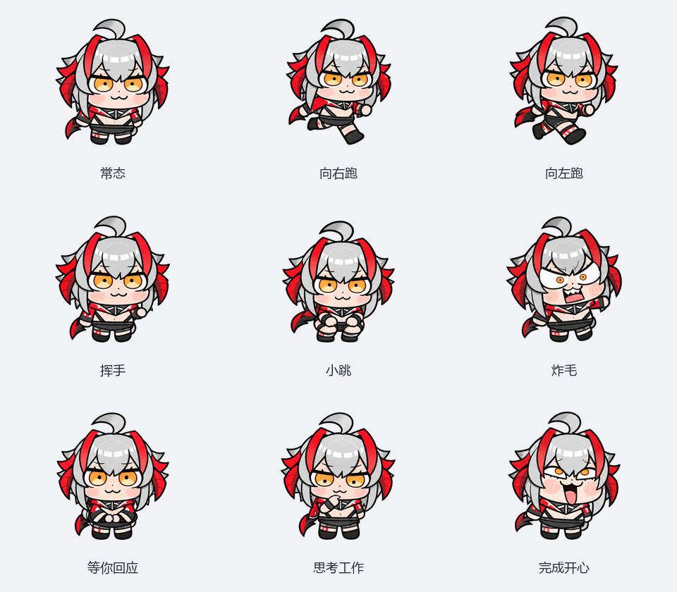
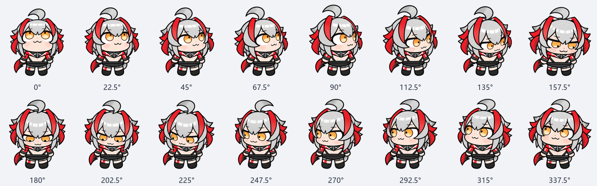

# Weiweimei: usage guide

**English** | [简体中文](USAGE.zh-CN.md)



## Preview

Open `index.html` beside this guide in a browser. Switch the nine animations, sixteen directions, light/dark backgrounds, and small display size. This works offline.

The preview's continuous-loop and mouse-direction controls demonstrate the artwork. The Codex desktop client controls native playback and interaction separately.

## Install on Windows

1. Copy the `weiweimei` folder to `%USERPROFILE%\.codex\pets\`. If `CODEX_HOME` is set, copy it to `<CODEX_HOME>\pets\` instead.
2. Confirm that `weiweimei\pet.json` and `weiweimei\spritesheet.webp` are directly inside the copied folder.
3. Open **Settings → Pets / Mini**, refresh the list, select **维维美 (Weiweimei)**, and show the pet or wake Mini. Labels may vary by client version.

For installation with hash checks, open PowerShell in the folder containing this guide and run:

```powershell
powershell -NoProfile -ExecutionPolicy Bypass -File .\Install-Pet.ps1
```

The script respects `CODEX_HOME`. For a custom destination, pass `-PetCodexHome 'C:\your-codex-home'`. It stops if the pet folder already exists and does not change the selected pet or application settings.

## Animations

| Artwork | Native row |
| --- | --- |
| Quiet blinking | `idle` |
| Right / left steps | `running-right` / `running-left` |
| Greeting wave | `waving` |
| Small jump | `jumping` |
| Startled reaction | `failed` |
| Patient waiting | `waiting` |
| Thinking / working | `running` |
| Happy completion | `review` |



The v2 atlas contains sixteen directional frames, starting upward and proceeding clockwise in 22.5-degree steps.

## Current limits

The project owner confirmed native selection, display, and normal appearance in the Windows client, and observed the working reaction briefly.

In the inspected client, the working animation plays three cycles, approximately 2.46 seconds, then returns to idle. The manifest cannot enable a persistent working loop. Use the client's task status to check whether work is still running.

Continuous physical-mouse tracking was unavailable in the native window. Completed, waiting, failed, dragging, and restart persistence have not been individually verified end to end. Other client versions and operating systems have not been tested.

## Check the package

The atlas is 1536 × 2288 pixels, with 73 populated cells and 15 unused transparent cells. `validation.json` records the asset checks; `QA.md` explains their scope.

Locally built release ZIPs include `SHA256SUMS.txt`. The builder also writes `ZIP-SHA256.txt` beside the archive. Installing only needs the two files inside `weiweimei/`; Python is only needed for development and packaging.

## Switch back

Choose your previous pet in Codex settings or turn off the pet display. After switching away, remove only the added `weiweimei` folder if you no longer need it.

## Sources

Based on project-owner-supplied Weiweimei references, with ImageGen supplements for missing poses and directions. Saved prompts are included in `sources/`. Organization was informed by [zili-codex-pet](https://github.com/2846182283/zili-codex-pet), without using its character atlas.
